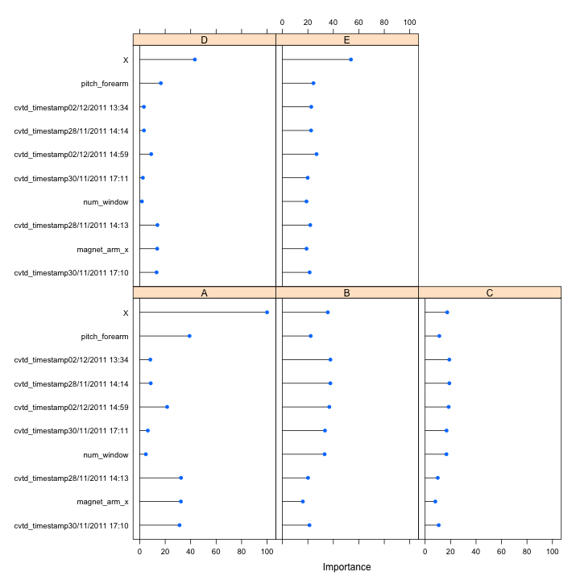
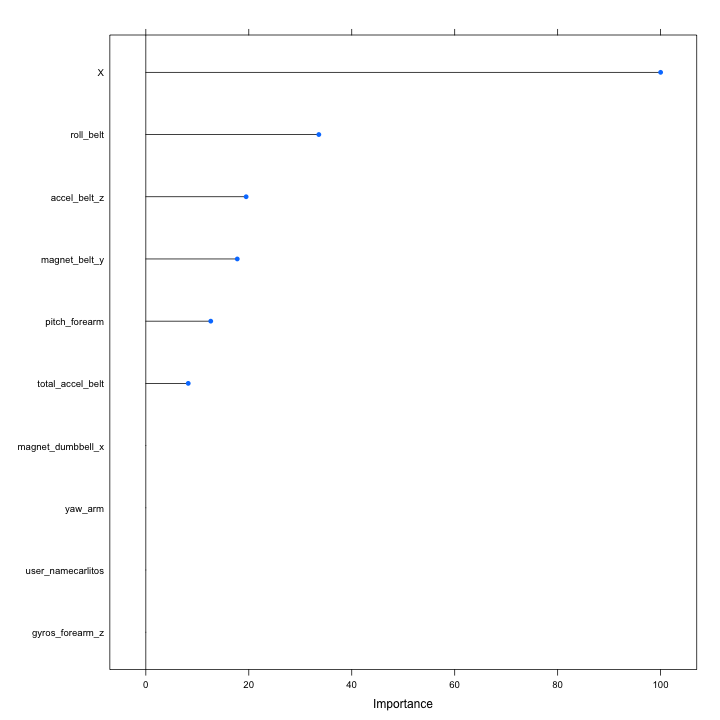

# Coursera Machine Learning Assignment
 
## Synopsis

This report is for the summer 2014 Coursera Practice Machine Learning Assignment. For this assignment I use classification and regression trees (CART) and partial least squares (PLS) models to predict weight lifting exercises in a Brazilian exercise dataset. 

The CART models perform significantly better than PLS. CART has approximately 66% accuracy on the test set, while PLS manages only 58%. 

 
## Data Processing

### Required Packages
I use two external pacakges for this project: caret and AppliedPredictiveModeling
 

```r
require(AppliedPredictiveModeling)
require(caret)
```

#Loading and Mainpulating Data

First, I read in the CSV assigned for this report.


```r
train <- read.csv("~/Downloads/pml-training.csv")

final_test <- read.csv("~/Downloads/pml-testing.csv")

dim(train)
```

```
## [1] 19622   160
```

```r
dim(final_test)
```

```
## [1]  20 160
```

```r
table(train$classe)
```

```
## 
##    A    B    C    D    E 
## 5580 3797 3422 3216 3607
```

```r
table(test$classe)
```

```
## Error: object 'test' not found
```

```r
class(train$classe)
```

```
## [1] "factor"
```

Next I remove all of the covariates with no variance, and those not found in the testing set.


```r
nzv <- nearZeroVar(train)
train <- train[, -nzv]
final_test <- final_test[, -nzv]

naFinal <- which(colSums(is.na(final_test)) == 20)
train <- train[, -naFinal]
final_test <- final_test[, -naFinal]
```

## Creating Testing and Training Dataframes

Next, I split the data into testing and training datasets. I assign 30% of the data to the testing dataset using "classe" as the outcome variable.

```r

inTrain <- createDataPartition(y = train$classe, p = 0.7, list = FALSE)
training <- train[inTrain, ]
testing <- train[-inTrain, ]
nrow(training)
```

```
## [1] 13737
```

```r
nrow(testing)
```

```
## [1] 5885
```


### Training

Here I train the models. I specify 10 fold repeated cross validation and I also center and scale the data in preprocessing.


```r
ctrl <- trainControl(method = "repeatedcv", number = 10, repeats = 2, classProbs = TRUE)


fit <- train(classe ~ ., data = training, method = "pls", trControl = ctrl, 
    preProc = c("center", "scale"))

cartfit <- train(classe ~ ., data = training, method = "rpart", trControl = ctrl)

# gbmfit <- train(classe~.,data=training, metod = 'gbm',
# preProc=c('center','scale'))


# rffit <- train(classe~.,data=training, method = 'rf',prox=TRUE)
```

I tried GBM and random forests, but could not manage to have them run in a reasonable time.

## Models

The final PLS model just used X as a predictor. It had 58% accuracy.


```r
fit
```

```
## Partial Least Squares 
## 
## 13737 samples
##    58 predictors
##     5 classes: 'A', 'B', 'C', 'D', 'E' 
## 
## Pre-processing: centered, scaled 
## Resampling: Cross-Validated (10 fold, repeated 2 times) 
## 
## Summary of sample sizes: 12363, 12365, 12365, 12362, 12363, 12363, ... 
## 
## Resampling results across tuning parameters:
## 
##   ncomp  Accuracy  Kappa  Accuracy SD  Kappa SD
##   1      0.4       0.3    0.004        0.006   
##   2      0.5       0.3    0.002        0.003   
##   3      0.6       0.5    0.009        0.01    
## 
## Accuracy was used to select the optimal model using  the largest value.
## The final value used for the model was ncomp = 3.
```

```r
fit$finalModel
```

```
## Partial least squares classification, fitted with the orthogonal scores algorithm.
## The softmax function was used to compute class probabilities.
## 
## Call:
## plsr(formula = y ~ x, ncomp = ncomp, data = tmpData, method = "oscorespls")
```


The final CART model also just used X as a predictor and had 75% accuracy.


```r
cartfit
```

```
## CART 
## 
## 13737 samples
##    58 predictors
##     5 classes: 'A', 'B', 'C', 'D', 'E' 
## 
## No pre-processing
## Resampling: Cross-Validated (10 fold, repeated 2 times) 
## 
## Summary of sample sizes: 12363, 12362, 12364, 12363, 12363, 12363, ... 
## 
## Resampling results across tuning parameters:
## 
##   cp   Accuracy  Kappa  Accuracy SD  Kappa SD
##   0.2  0.7       0.7    0.09         0.1     
##   0.3  0.6       0.4    0.09         0.1     
##   0.3  0.4       0.2    0.1          0.2     
## 
## Accuracy was used to select the optimal model using  the largest value.
## The final value used for the model was cp = 0.2.
```

```r
cartfit$finalModel
```

```
## n= 13737 
## 
## node), split, n, loss, yval, (yprob)
##       * denotes terminal node
## 
## 1) root 13737 9831 A (0.28 0.19 0.17 0.16 0.18)  
##   2) X< 5582 3906    0 A (1 0 0 0 0) *
##   3) X>=5582 9831 7173 B (0 0.27 0.24 0.23 0.26)  
##     6) X< 9376 2658    0 B (0 1 0 0 0) *
##     7) X>=9376 7173 4648 E (0 0 0.33 0.31 0.35) *
```


Variable importance is displayed graphically in the plots below.


```r
plot(varImp(fit), top = 10)
```

 

```r
plot(varImp(cartfit), top = 10)
```

 

### Predictions

The PLS models correctly predict 58% of the training data, while the cart models predict 66% correctly. 


```r
plsresults <- sum(testing$classe == predict(fit, testing, verbose = TRUE))
```

```
## Number of training samples: 13737 
## Number of test samples:     0 
## 
## pls : 5885 unknown predictions were added
```

```r

plsresults
```

```
## [1] 3399
```

```r

plsresults/length(testing$classe)
```

```
## [1] 0.5776
```

```r

cartresults <- sum(testing$classe == predict(cartfit, testing, verbose = TRUE))
```

```
## Number of training samples: 13737 
## Number of test samples:     0 
## 
## rpart : 5885 unknown predictions were added
```

```r

cartresults
```

```
## [1] 3893
```

```r

cartresults/length(testing$classe)
```

```
## [1] 0.6615
```

### Conclusion

I am dissapointed in the performance of my models. If I had more time I would like to fit a random forest or GBM to this data.


# End
